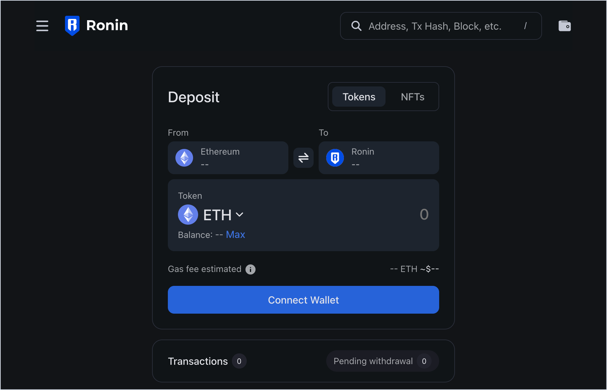
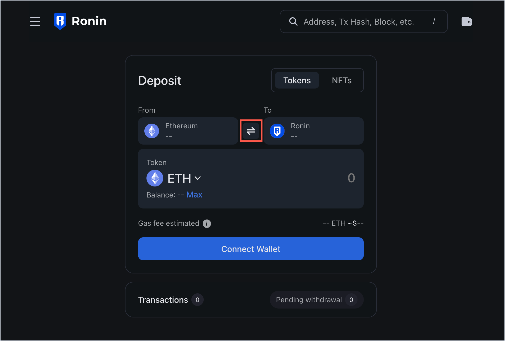
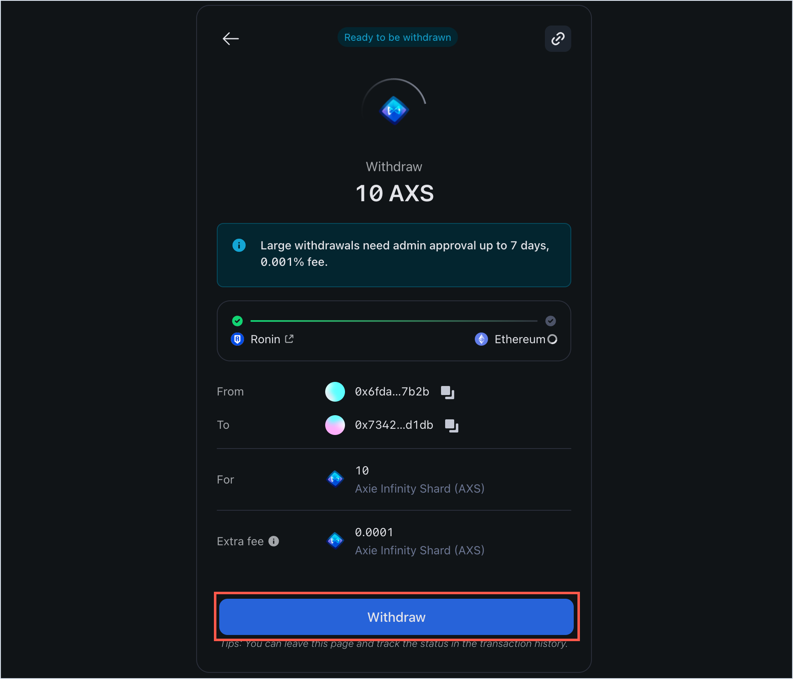

## Overview

This guide describes how to use Ronin Bridge to send an ERC20 token from your Ronin Wallet to an Ethereum address.

## Prerequisites

If you access Ronin Bridge on mobile, remember to import your Ethereum address to your mobile Ronin Wallet. To learn how to do that, see [Importing Your MetaMask Wallet to Ronin Wallet](https://support.roninchain.com/hc/en-us/articles/14862812718107-Importing-Your-MetaMask-Wallet-to-Ronin-Wallet).

## Step 1. Add the sender and recipient addresses

1. Open [Ronin Bridge](https://app.roninchain.com/bridge).
   
2. Switch to the withdrawal feature by selecting the button between the **From** and **To** fields.
   
3. In the **From** field, connect your Ronin Wallet using the browser extension or mobile app for your device.
   
4. In the **To** field, enter the Ethereum address that you want to bridge the token to. Double-check the recipient address to avoid sending your tokens to the wrong destination.
   :::note[Ronin Wallet app]
   If you access Ronin Bridge through the Ronin Wallet mobile app, then you can enter any Ethereum address as a recipient, but only your imported Ethereum wallet can pay gas in ETH for the transaction.
   :::
   

## Step 2. Choose the token and amount

1. Choose the ERC20 token that you want to withdraw, then enter the withdrawal amount manually or select **Max** to withdraw the entire balance of this token available in your wallet.
   
2. When prompted, select **Approve** to approve the new spending cap for the selected token.
   :::note[Spending cap]
   When you bridge an ERC20 token for the first time, you need to set a spending cap. To do that, enter your desired token amount, then follow instructions on the screen to approve the cap. In the future, when you bridge an amount that exceeds your current cap, you will need to approve a new spending cap corresponding to the higher amount.
   :::
   
3. When prompted, sign the transaction in your Ronin Wallet.

## Step 3. Confirm your withdrawal

1. Review the transaction details, including the gas fees associated with the withdrawal. Make sure you have enough ETH in your Ethereum wallet to cover the fees. If everything looks correct, select **Submit withdrawal**.
   
2. When prompted, sign the transaction in your Ronin Wallet.
3. Select **Connect Wallet** and connect your Ethereum wallet.
   
4. Wait for the transaction to be confirmed by the network. Be patient, however, as transactions can take some time to complete, depending on network congestion and gas fees.
   
5. When the amount is ready to be withdrawn, select **Withdraw** to bridge the tokens to your Ethereum address.
   
6. When prompted, sign the transaction in your connected Ethereum wallet to receive the tokens.

## Step 4. Receive the tokens in your Ethereum wallet

When the withdrawal is complete, you'll see a "Withdrawal completed" window.

You can check your connected wallet to verify that the tokens have arrived successfully.
