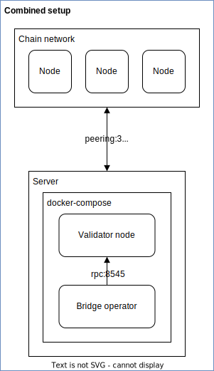

import DocCardList from '@theme/DocCardList';
import {findSidebarItem} from '@site/src/sidebarUtils';

## Overview

If you’re interested in setting up a node on the Ronin mainnet,
here are some hardware recommendations and guides on different
methods of installation.

:::info
For testnet installation guides, see [Saigon testnet](./testnet/).
:::

## Hardware requirements

To run a reliable, performant node on the Ronin mainnet, we suggest that the node’s hardware profile should match or exceed the following specifications:

|   Validator node          |   Non-validator node      |   Archive node         |   Bridge operator         |
|---------------------------|---------------------------|------------------------|---------------------------|
|   8-core CPU              |   6-core CPU              |   8-core CPU           |   4-core CPU              |
|   32 GB RAM               |   25 GB RAM               |   32 GB RAM            |   8 GB RAM                |
|   700 GB high-speed SSD   |   700 GB high-speed SSD   |   7 TB high-speed SSD  |   100 GB high-speed SSD   |
|   x86-64 architecture     |   x86-64 architecture     |   x86-64 architecture  |   x86-64 architecture     |

These hardware requirements are rough guidelines, and each node operator should monitor their node to ensure good performance for the intended task. The size of your Ronin node will also grow over time.

## Get started with node installation

We offer two different methods of installing nodes:

* The [Docker](/docs/tags/docker-mainnet) method describes the installation of Ronin nodes as Docker instances, for those comfortable with Docker. Two different approaches to setting up your nodes using Docker are described in the following sections.
* The [CLI](/docs/tags/cli) (command line interface) method uses a CLI tool to compile your own node binary from source. For more information, see [Build your node using Ronin CLI](./../setup/cli.md).

### Choose an approach

Within the Docker method, there are two ways to approach the installation of a validator and a bridge operator:

* Combined setup
* Standalone setup

#### Combined setup

In a combined setup, the validator and the bridge are defined in the same `docker-compose.yml` file and run on one machine. We recommend this approach to most users for easier onboarding.

Follow this guide for a combined setup:
<DocCardList items={[
    findSidebarItem('/docs/validators/setup/mainnet/run-combined'),
    ]} />

#### Standalone setup

In a standalone setup, the validator node and the bridge operator are defined in two different `docker-compose.yml` configurations and run on two machines, respectively. In this approach, a non-validator node runs alongside the bridge component, allowing you to isolate the resources between the validator and the bridge for enhanced reliability and security.

Follow these guides for a standalone setup:
<DocCardList items={[
    findSidebarItem('/docs/validators/setup/mainnet/run-validator'),
    findSidebarItem('/docs/bridge-operators/setup/run-bridge-operator'),
    ]} />
